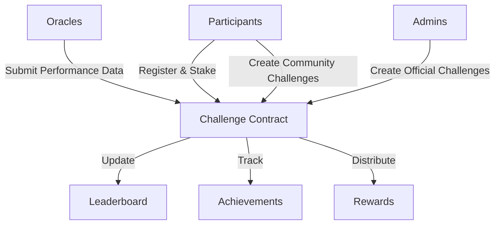

# BackRun Challenge Platform

A decentralized blockchain platform for fitness challenges, performance tracking, and community-driven reward distribution.

## Overview

BackRun enables users to participate in multi-disciplinary fitness challenges on the blockchain. The platform features:

- Creation and participation in performance challenges
- Verified activity tracking through decentralized oracles
- Automated, transparent reward distribution
- Dynamic, community-driven leaderboards
- Both official and user-generated challenges
- Stake-based participation model

## Architecture

The BackRun system is built around a core smart contract that handles:



### Core Components:
- Dynamic Challenge Management
- Flexible Participant Registration
- Performance Data Verification
- Comprehensive Achievement Tracking
- Equitable Reward Distribution
- Transparent Leaderboard System

## Contract Documentation

### BackRun Challenge Contract (`backrun-challenge.clar`)

The core contract powering the BackRun ecosystem's challenge mechanics.

#### Key Features:
- Robust role-based access control
- Flexible challenge creation and management
- Comprehensive participant tracking
- Secure performance data submission
- Granular achievement recognition
- Fair, algorithmic reward distribution
- Real-time, immutable leaderboards

#### Access Control
- Contract Owner: Ultimate platform governance
- Admins: Platform challenge curation
- Oracles: Performance data validation
- Users: Challenge creation and participation

## Getting Started

### Prerequisites
- Clarinet
- Stacks wallet
- STX tokens for participation

### Basic Usage

1. **Creating a Challenge**
```clarity
(contract-call? .backrun-challenge create-challenge
    "30-Day Performance Challenge"
    "Complete 300 km of running or cycling"
    false  ;; community challenge
    u1234567890  ;; start time
    u1237246290  ;; end time
    u300000  ;; activity goal
    u200000  ;; distance goal in meters
    u50000000  ;; entry fee in microSTX
    u250  ;; max participants
    u0)  ;; initial reward pool
```

2. **Registering for a Challenge**
```clarity
(contract-call? .backrun-challenge register-for-challenge u1)
```

3. **Submitting Performance Data (Oracle)**
```clarity
(contract-call? .backrun-challenge submit-performance-data 
    u1  ;; challenge-id
    tx-sender  ;; participant
    u75000  ;; activity units
    u60000)  ;; distance
```

4. **Claiming Rewards**
```clarity
(contract-call? .backrun-challenge claim-rewards u1)
```

## Function Reference

### Administrative Functions
- `set-contract-owner`: Update contract owner
- `grant-role`: Assign roles to addresses
- `revoke-role`: Remove roles from addresses

### Challenge Management
- `create-challenge`: Create new walking challenge
- `end-challenge`: Conclude an active challenge
- `add-to-reward-pool`: Add funds to challenge rewards

### Participant Functions
- `register-for-challenge`: Join a challenge
- `claim-rewards`: Collect earned rewards

### Oracle Functions
- `submit-step-data`: Submit verified step counts

### Read-Only Functions
- `get-challenge`: Retrieve challenge details
- `get-participant-data`: Get participant statistics
- `get-leaderboard`: View challenge rankings
- `get-achievements`: Check participant achievements
- `get-estimated-reward`: Calculate potential rewards

## Development

### Testing
```bash
# Run contract tests
clarinet test

# Check contract deployment
clarinet console
```

### Local Development
1. Clone the repository
2. Install Clarinet
3. Deploy contracts locally:
```bash
clarinet deploy --local
```

## Security Considerations

### Known Limitations
- Performance data depends on trusted oracle validation
- Leaderboard capped at top 50 participants
- Challenge duration restricted (1-30 days)

### Best Practices
- Carefully review challenge parameters
- Confirm transactions before updating UI
- Monitor oracle performance data
- Validate reward calculations pre-claim

### Risk Mitigation
- Performance data validated monotonically
- Rewards held in escrow until challenge completion
- Strict role-based access controls
- Robust challenge parameter validation